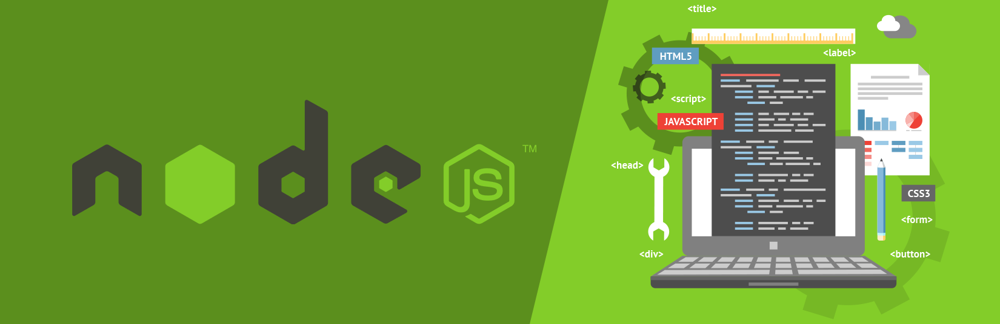

# Mi servidor web

* **Track:** _Creando mi servidor web_
* **Desarrolladoras:** _Margarita Sutta._

***

Acontinuación crearemos nuestro servidor web con la tecnologia **node.js**, configurando el localhost con puerto de salida 3000, basado en **Javascript ES6**.

***

